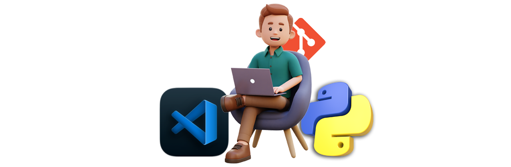
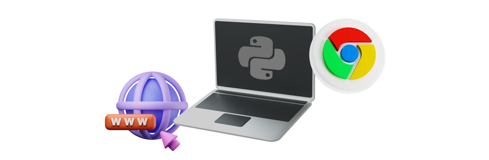
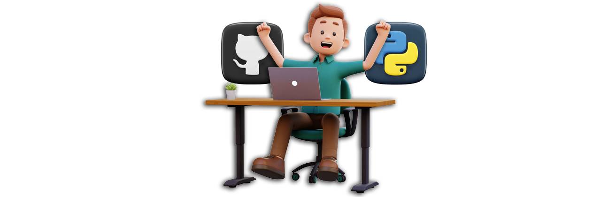

# Python Fundamentals

## 👋 Bienvenid@s
- Al finalizar este curso podrás comprender la sitaxis básica de Python y podrás crear programas desde cero para resolver problemas enfocados a problemáticas de la vida real haciendo uso de los pílares del pensamiento lógico computacional.

## Requisitos Previos

* Tener conocimientos de informática intermedios, archivos y carpetas, además de saber usar apps (como las de hojas de cálculo, procesadores de texto o editores de fotos).

* Ser capaz de descargar, instalar y actualizar software.

## 💻 Requerimientos
A continuación se muestran los requsitos mínimos para poder realizar las prácticas de manera correcta. 
<ul>
    <li> Microsoft® Windows® 8/10/11 de 64 bits </li>
    <li> Arquitectura de CPU x86_64; procesador Intel Core de segunda generación o posterior, o CPU AMD compatible con un hipervisor de Windows </li>
    <li>4 GB de RAM o más </li>
    <li>4 GB de espacio disponible en el disco como mínimo (IDE + Explorador) </li>
</ul>

## 🧑‍💻 Proyecto Final

* El objetivo de este curso de Python es practicar y llevar tus habilidades de lógica al siguiente nivel a través de prácticas y ejercicios planeados para este curso enfocados en resolución de problemas de la vida cotidiana. 

* En este curso tienes la oportunidad de crear tus propios programas, analizar datos y crear gráficas . 

Este curso va a evaluar 3 proyectos usando los siguientes temas:

- Coficicación en Python
- Tipos de datos
- Operadores lógicos
- Variables
- Condicionales
- Funciones
- Ciclos
- Editor de texto
- Gráficas
- Control de versiones
- Interfaces Gráficas
- Api's

## 📘 Temario del curso

1. [Sesion 01](Sesion01/Readme.md)&nbsp;Introducción a los pilares del pensamiento lógico computacional. (Conceptos Básicos)
2. [Sesion 02](Sesion02/Readme.md)&nbsp;Variables, Tipos de datos y Operadores Aritméticos.
