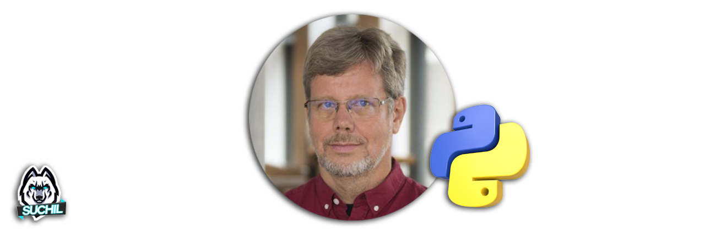
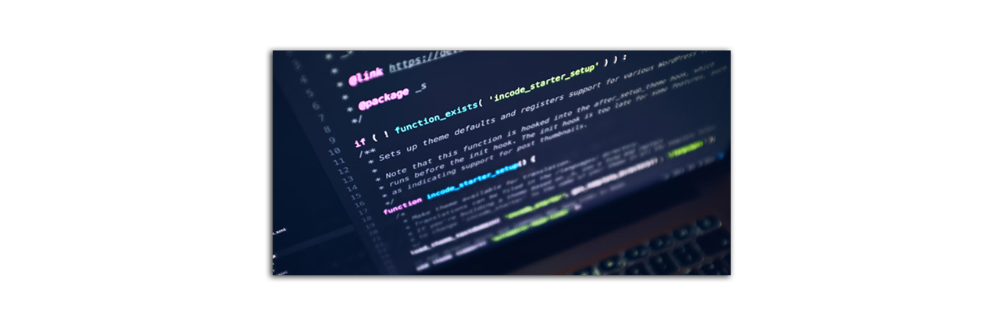
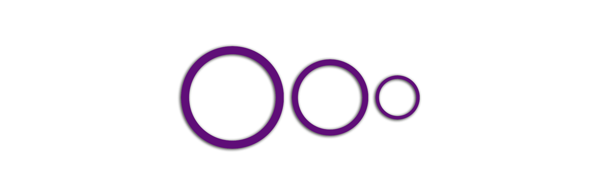
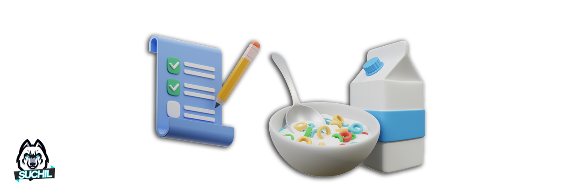

# Presentación e introducción al PLC (Pensamiento Lógico Computacional)

## 👋 Presentación
- Te damos la bienvenida a esta sesión de introducción de Python como lenguaje de programación.

## 🎯 Objetivo

En esta primera sesión comezarás con la **introducción** al lenguaje de programación **Python**,conocerás los precedentes del lenguaje, conocerás que es un editor de texto y lo más importante será conocer los pilares del pensamiento lógico computacional.

## 📮 Requerimientos
A continuación se muestran los requsitos mínimos para poder realizar las prácticas de manera correcta. 
<ul>
    <li> Cumputadora o Smartphone </li>
    <li> Conexión a internet</li>
    <li> Creatividad </li>
    <li> Atención </li>
</ul>

## ⏳ Precendentes

* **Python** es un lenguaje de programación de alto nivel (significa que esta diseñado para ser fácil de leer y escribir ) que fue creado por **Guido van Rossum** a finales de los años 80 y principios de los 90"s. Van Rossum comenzó a trabajar en Python en diciembre de 1989 como un proyecto personal durante su tiempo en el Centro para las Matemáticas y la Computación (CWI) en los Países Bajos.

* El objetivo de Van Rossum era crear un lenguaje que fuera fácil de leer y aprender, inspirado en el lenguaje de programación ABC. La primera versión pública de Python, la 0.9.0, se lanzó en febrero de **1991**. Desde entonces, Python ha evolucionado significativamente, con la versión 1.0 lanzada en enero de 1994, la versión 2.0 en octubre de 2000, y la versión 3.0 en diciembre de 2008.

* Python es conocido por su **sintaxis**( es un conjunto de reglas y estructuras que definen cómo se deben escribir las instrucciones en un lenguaje de programación específico ) clara y legible, lo que lo convierte en una excelente opción tanto para principiantes como para desarrolladores experimentados. Hoy en día, se utiliza en una amplia variedad de aplicaciones, desde desarrollo web hasta análisis de datos e IA.

## 👩‍💻 Pilares del Pensamiento Lógico Computacional

Proceso mental a través del cual una persona se plantea un problema 
y para su posible solución utiliza una secuencia de instrucciones.

* Descomposición: Ruptura de un problema en partes más pequeñas.

* Reconocimiento de patrones: Mirar similitudes que se comparten.

* Abstracción: Centrarse en la información importante.

* Algoritmo: Plan o conjunto de instrucciones, para resolver un problema.

## 💻 Primer práctica Hola Mundo

* Primero vamos a abrir nuestro explorador chrome, si no cuentas con el <a href="https://www.google.com.mx/intl/es-419/chrome/?gad_source=1&gclid=Cj0KCQjwzby1BhCQARIsAJ_0t5N9F0tV5OBlWxzP785Q2fblTO_UyMzBYiJM26qwGTDhwThDHi1Y6bUaAl8yEALw_wcB">Puedes Descargarlo aquí.</a>

* Vas a dirigirte a <a href="https://www.google.com.mx/intl/es-419/chrome/?gad_source=1&gclid=Cj0KCQjwzby1BhCQARIsAJ_0t5N9F0tV5OBlWxzP785Q2fblTO_UyMzBYiJM26qwGTDhwThDHi1Y6bUaAl8yEALw_wcB">Edublocks</a>
 que será nuestro editor online para hacer nuestras primeras prácticas, recuerda que este editor puede presentar fallos o bugs si se habre en un explorador diferente a chrome.

Este curso va a evaluar 2 proyectos usando los siguientes temas:

- Coficicación en Python
- Variables
- Condicionales
- Ciclos
- Control de versiones
- Interfaces Gráficas
- Apis

## 📝 Organización de la clase

- [Práctica](practica/README.md)
- [Presentación - Sesión 07](presentacion/Sesion-07.pptx)