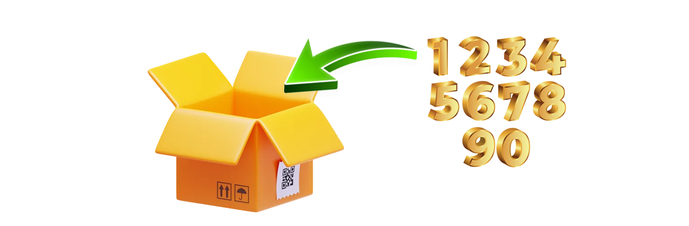
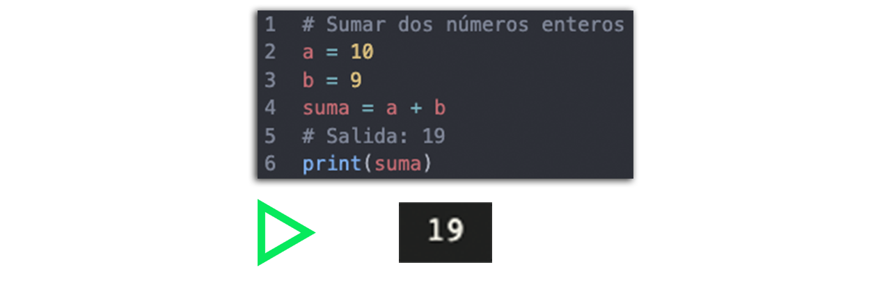
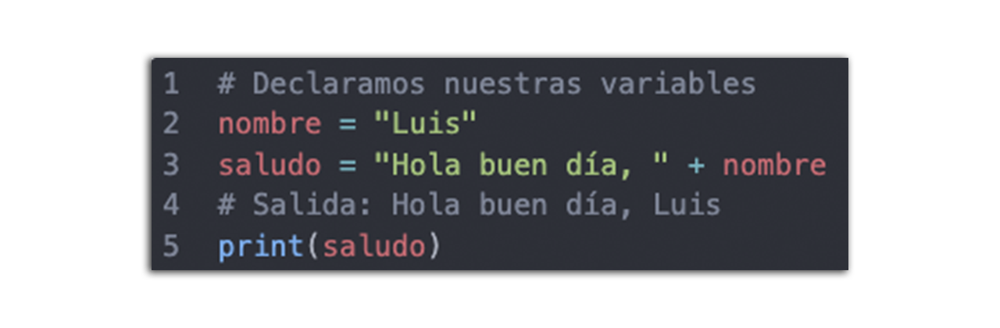

# Sesion 02 - Variables

## 📢 ¿Que es una variable?
- Una variable en programación es un elemento de datos cuyo valor puede cambiar 
durante el curso de la ejecución de un programa.

## 📋🖋 Nombrar una variable
Tienes que tener en cuenta que las variables unicamente pueden contener letras mayúsculas y minúsculas (A-z), números (0-9), y el guión bajo ( _ ).
 Para asignar un valor a una variable en Python, se utiliza el operador =.
- **Ejemplo**
- mis_materias = 7
- misMaterias = 7

## Tipos de datos en variables

En Python, las variables pueden almacenar diferentes tipos de datos:

* Enteros (int): Números sin decimales, como 10 o -3.
* Flotantes (float): Números con decimales, como 3.14 o -0.001.
* Cadenas de texto (str): Texto, como "Hola" o "Python".
* Booleanos (bool): Valores de verdad, True o False.

## Enteros - int
En Python, los números enteros, o int, son valores numéricos sin parte decimal. Pueden ser positivos, negativos o cero.

## Concatenar

Concatenar en Python significa unir dos o más cadenas de texto (strings) en una sola.
